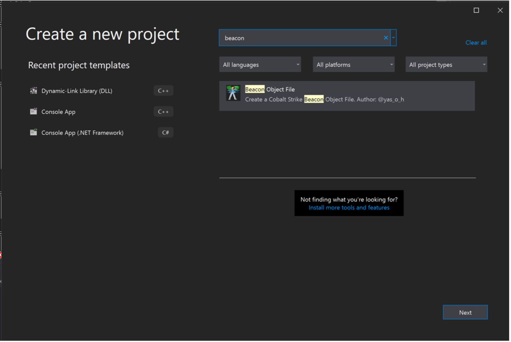
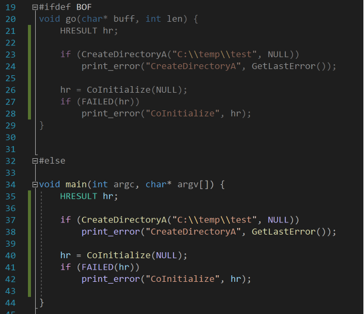
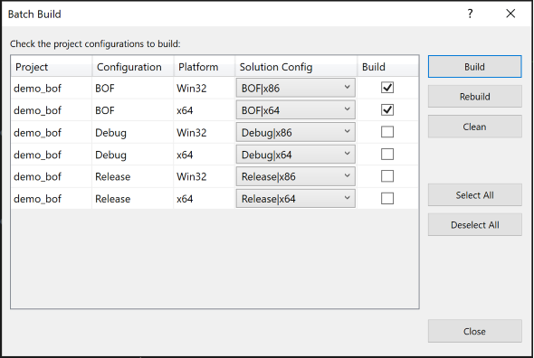
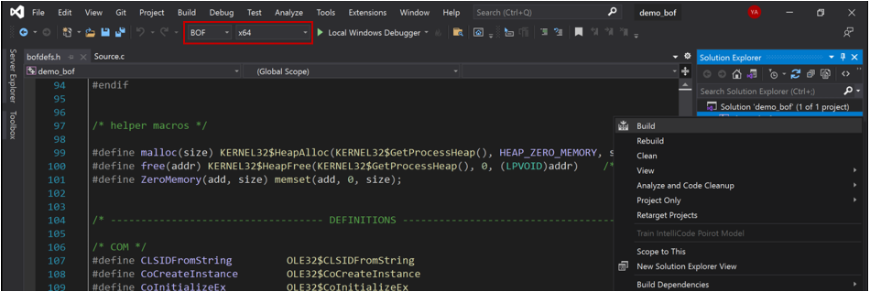

### Introduction

Cobalt Strike beacon object files (BOFs) is a feature that added to the beacon in order to allow rapid beacon extendibility in a more OPSEC way. The BOF file is a COFF object file that will be executed in the same process as the beacon and therefore eliminates the need for using OPSEC expensive techniques like fork&run. BOFs are written in C\C++ and can be built using Visual Studio or MinGW. The official documentation on BOFs can be found [here](https://www.cobaltstrike.com/help-beacon-object-files). TrustedSec provided a well-written [introduction to BOFs for developers](https://www.trustedsec.com/blog/a-developers-introduction-to-beacon-object-files/), and also provided an [example COFF loader](https://www.trustedsec.com/blog/coffloader-building-your-own-in-memory-loader-or-how-to-run-bofs/) for those interested in learning more about how BOFs work under the hood. 

Developing Windows applications in Visual Studio has its advantages, mainly the ease of building, debugging, and testing as well as the integration of testing tools like virtual leak detector, application verifier, cppcheck, and so on. However, creating BOFs with Visual Studio is unpleasant because of the syntax of dynamic function resolution and because additional steps must be taken to generate the BOF and strip its debug symbols. Additionally, sometimes BOFs fail in engagements, and it would be handy to know the cause of the failure in production. 

I wanted to create a baseline template that can be reused to develop BOFs with Visual Studio without having to worry about dynamic function resolution syntax, stripping symbols, compiler configurations, C++ name mangling, or unexpected runtime errors. Thus, the requirements were

1. Default debug and release build configurations for debugging and testing for aspects like memory or handle leaks
1. Custom BOF build configuration that will generate the BOFs, strip their debug symbols, and move them to an output directory
1. Prebuilt list of function definitions to allow developers to reuse existing code without having to add the dynamic function resolution syntax
1. Built-in error function that will print, in production, which line and function caused the error
1. Ability to write simple C++ code without having to worry about name mangling

A first prototype that fulfills these requirements was created and is available on GitHub.

### Usage Instructions

##### Importing The Template to Visual Studio

To use the template, copy the zip file from the [GitHub repo](https://github.com/securifybv/Visual-Studio-BOF-template) into the project templates directory under My Documents. For Visual Studio 2019, the directory would be 

%UserProfile%\Documents\Visual Studio 2019\Templates\ProjectTemplates 

The template will be automatically loaded into Visual Studio the next time you run it. After a restart, you can search for “beacon” on the new project wizard to find the template.

##### Default Structure

The structure of the solution is shown in the image below. The *Header Files* filter contains the two headers needed to develop BOFs. The first header is the beacon header provided by the Cobalt Strike team. The bofdefs header is a modified version of the bofdefs header from TrustedSec. Next, the *Resources* filter contains a PowerShell script that will strip the debugging symbols. This PowerShell script is based on the work of Matthew Graeber (@mattifestation) on his ObjDump script. Finally, the *Source Files* filter contains the source code of the BOF.

##### Using The Template

The template makes it as easy as copying the *main* code to the *go* function for BOFs that take no arguments. The image below shows that the code in *go* is identical to the code in *main*. The ability to reuse the code without further modification increases the efficiency of porting existing projects into BOFs and eliminates the unnatural syntax of dynamic function resolution. For BOFs that take arguments, only the argument parsing part will be different. A goal for next versions is to create generic argument parsing macros or functions to eliminate the need for any modification.

When the code is ready, it can be built for x64 and x86 BOFs at one go using the predefined build configuration inside the project template. In order to do so, go to Build -> Batch Build and tick the two architectures.

In order to build for only one architecture, select the appropriate BOF build configuration from the dropdown menu and hit build, as shown in the image below.

Regardless of the method used to build the BOF, the result is a stripped BOF ready to be used with Cobalt Strike. 

##### BOFs & COM Objects

Sometimes, especially when dealing with component object model (COM) objects, it is easier to use C++ instead of C. The template supports that as well. Simply rename the Source.c to Source.cpp and compile. You will be spared from name mangling because the template will automatically add *extern “C”* if C++ is used. However, you should not get your hopes up too high with developing C++ BOFs, as this is not yet fully supported by Cobalt Strike.

##### Error Reporting

The template comes with a built-in function to print errors in a meaningful manner for operators. The purpose is to provide the operators with sufficient information to understand why the BOF failed without revisiting the source code. The error message below is a screenshot from the Cobalt Strike console and provides the following information for the operators: the error occurred 

- Name function causing the error: create\_folder
- Line number: 164
- Description by developer: “failed to create directory”
- WIN32 error code: 123

##### Modifying the template

Different teams have different needs, and therefore this template might not be suitable for everyone. Modifying the template is easy. Just unzip the zip file, make your modifications to the files, and zip it again!

### Example projects

To show how this template can be used, I have included two sample BOFs. The first BOF is a port of @am0nsec AppLocker enumerator, which will dump the effective AppLocker policy as beacon output. The second example is a scheduled task persistence that relies heavily on COM. 

### Feature work

This template is an initial prototype and many more features can be added to it. For example, the features on my to-do list includes:

- Adding generic argument parsing that can be used by *main* and *go* without modifications
- Internal print that takes variadic arguments

Pull requests and ideas are also most welcome!

### Acknowledgments

- Big thanks to the [TrustedSec](https://www.trustedsec.com/) team and [@FreeFirex](https://twitter.com/freefirex2) for sharing the code of the situational awareness BOFs [here](https://github.com/trustedsec/CS-Situational-Awareness-BOF). This template relied heavily on their work.
- Paul ([@am0nsec](https://twitter.com/am0nsec)) for sharing his code and experience with undocumented COM objects [here](https://ntamonsec.blogspot.com/2020/08/applocker-policy-enumeration-in-c.html).
- Matthew ([@mattifestation](https://twitter.com/mattifestation)) for sharing his work on PowerShell ObjDump [here](https://www.powershellgallery.com/packages/PowerSploit/1.0.0.0/Content/PETools%5CGet-ObjDump.ps1).

### Author

This project is created and maintained by Yasser Alhazmi [@yas_o_h](https://twitter.com/Yas_o_h) / [Securify](https://www.securify.nl/en/)

